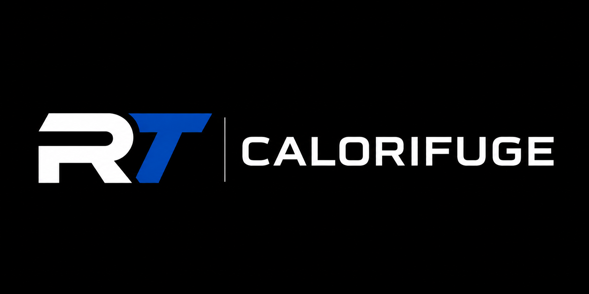

# RT Calorifuge — site internet

Site vitrine B2B orienté conversion, en HTML / CSS / JavaScript. Aucune installation, aucun build, aucune dépendance externe.

---

## 1. Contenu du dossier

```
rt-calorifuge/
├── index.html                                  Page principale (13 sections)
├── calorifuge-gaines-25-50mm.html              Page SEO — épaisseurs et types de gaines
├── sous-traitance-calorifuge-ventilation.html  Page SEO — renfort et sous-traitance
├── mentions-legales.html
├── politique-de-confidentialite.html
├── robots.txt
├── sitemap.xml
├── css/
│   └── style.css
├── js/
│   ├── config.js      ← LE SEUL FICHIER À MODIFIER POUR VOS COORDONNÉES
│   └── main.js
└── assets/
    ├── favicon.svg
    ├── logo-rt-calorifuge.svg        (version foncée, en-tête)
    ├── logo-rt-calorifuge-blanc.svg  (version claire, pied de page)
    └── img/
        ├── hero-calorifuge-gaines-ventilation.svg
        └── realisations/ (9 visuels provisoires)
```

---

## 2. Remplacer vos coordonnées — 2 minutes

Ouvrez **`js/config.js`** dans n'importe quel éditeur de texte et remplissez les valeurs entre guillemets. Tout le site se met à jour automatiquement : en-tête, hero, FAQ, bloc urgence, formulaire, pied de page, barre mobile, données structurées Google.

```js
phoneDisplay: "06 12 34 56 78",     // affiché à l'écran
phoneLink:    "+33612345678",       // utilisé pour l'appel (format international)
email:        "contact@rt-calorifuge.fr",
zone:         "Île-de-France et régions limitrophes",
horaires:     "Du lundi au vendredi, 7h30 - 18h00",
adresse:      "12 rue Exemple, 93000 Bobigny",
siret:        "123 456 789 00012",
whatsapp:     "",                   // vide = bouton WhatsApp masqué
linkedin:     "",                   // vide = lien masqué
web3formsKey: "",                   // voir §4
siteUrl:      "https://www.rt-calorifuge.fr"
```

Tant qu'une valeur reste vide, le site affiche le placeholder correspondant : `[NUMÉRO DE TÉLÉPHONE]`, `[ADRESSE E-MAIL]`, `[ZONE D'INTERVENTION]`, `[ADRESSE]`, `[SIRET]`, `[HORAIRES]`.

### Placeholders restants (à modifier directement dans le HTML)

| Fichier | À compléter |
|---|---|
| `mentions-legales.html` | `[FORME JURIDIQUE]`, `[NUMÉRO DE TVA]`, `[NOM DU DIRECTEUR DE LA PUBLICATION]`, `[NOM DE L'HÉBERGEUR]`, `[ADRESSE DE L'HÉBERGEUR]`, `[TÉLÉPHONE DE L'HÉBERGEUR]`, `[COMPAGNIE D'ASSURANCE]`, `[NUMÉRO DE CONTRAT]`, `[ZONE COUVERTE]` |
| `politique-de-confidentialite.html` | `[NOM DU PRESTATAIRE DE FORMULAIRE]`, `[NOM DE L'HÉBERGEUR]`, `[DURÉE]` |
| `index.html` (section Réalisations) | La mention `[PHOTOS DES RÉALISATIONS — à remplacer…]` : supprimez-la une fois vos vraies photos en ligne |

### Nom de domaine

Si votre domaine n'est pas `www.rt-calorifuge.fr`, remplacez cette adresse partout :
- balises `<link rel="canonical">` et `og:*` en haut de chaque page HTML
- `robots.txt`
- `sitemap.xml`
- clé `siteUrl` dans `js/config.js`

---

## 3. Remplacer les images

### Le logo
Déposez vos fichiers dans `assets/` en gardant les mêmes noms, ou changez l'extension dans le HTML :

```html
   <!-- en-tête -->
  <!-- pied de page -->
```

Les logos fournis sont des reconstitutions provisoires. Remplacez-les par vos fichiers officiels (SVG de préférence, sinon PNG à fond transparent, ~600 px de large).

### La photo du hero
Fichier : `assets/img/hero-calorifuge-gaines-ventilation.svg` (visuel provisoire).

Remplacez-le par une photo réelle de chantier montrant des gaines de ventilation calorifugées correctement posées, puis mettez à jour le `src` dans `index.html` :

```html

```

Format conseillé : **1600 × 1000 px, JPG ou WebP, compressé sous 250 Ko** (squoosh.app ou tinypng.com).

### Les réalisations
Neuf emplacements dans `assets/img/realisations/`. Remplacez les fichiers, puis dans `index.html` :

1. mettez à jour le `src` de chaque `` ;
2. adaptez le texte `alt` (important pour le référencement) ;
3. adaptez la légende dans `<div class="shot__caption">` : type de bâtiment, épaisseur, type de gaine, nature de l'intervention ;
4. vérifiez l'attribut `data-cat` — c'est lui qui alimente les filtres.

Valeurs possibles pour `data-cat` (plusieurs, séparées par un espace) :
`rectangulaire`, `circulaire`, `25mm`, `50mm`, `local-technique`, `grandes-longueurs`, `acces-difficile`, `tertiaire`, `industriel`

Exemple :
```html
<li class="shot" data-cat="rectangulaire 50mm industriel">
  
  <div class="shot__caption">
    <strong>Usine</strong><span>Gaines rectangulaires · 50 mm · Extraction</span>
  </div>
</li>
```

Pour ajouter une photo, dupliquez un bloc `<li class="shot">`. Pour en retirer une, supprimez le bloc.

---

## 4. Faire fonctionner le formulaire

Le formulaire valide les champs côté navigateur puis envoie la demande. Deux modes :

### Mode recommandé — Web3Forms (gratuit, pièces jointes incluses)

1. Allez sur **https://web3forms.com**, saisissez votre e-mail professionnel.
2. Vous recevez une clé (Access Key) par e-mail.
3. Collez-la dans `js/config.js` :
   ```js
   web3formsKey: "votre-cle-ici",
   ```
4. C'est terminé. Chaque demande arrive dans votre boîte mail avec les plans et photos joints.

> Alternative équivalente : Formspree, Basin ou Tally. Il suffit de remplacer l'URL `https://api.web3forms.com/submit` dans `js/main.js`.

### Mode de secours — mailto

Si `web3formsKey` reste vide mais que `email` est renseigné, le formulaire ouvre le logiciel de messagerie du visiteur avec toutes les informations pré-remplies. Fonctionne partout, mais sans pièces jointes automatiques — à réserver au dépannage.

### Message affiché après envoi

> « Votre demande a bien été transmise. RT Calorifuge vous recontactera après étude des informations. »

Modifiable dans `index.html`, bloc `<div class="form__success">`.

---

## 5. Activer le bouton WhatsApp

Par défaut, le bouton WhatsApp de la barre mobile est **masqué**. Pour l'activer, renseignez dans `js/config.js` :

```js
whatsapp: "https://wa.me/33612345678",
```

(numéro au format international, sans `+`, sans espace). Laissez `""` pour qu'il reste invisible.

---

## 6. Lancer le site en local

Double-cliquez simplement sur `index.html` : il s'ouvre dans votre navigateur.

Pour un aperçu plus fidèle (utile pour tester le formulaire), lancez un petit serveur local depuis le dossier :

```bash
# Python (déjà installé sur Mac et Linux)
python3 -m http.server 8000

# ou Node.js
npx serve .
```

Puis ouvrez `http://localhost:8000`.

---

## 7. Mettre le site en ligne

### Option A — Netlify (le plus simple, gratuit, HTTPS inclus)
1. Créez un compte sur **netlify.com**.
2. Onglet *Sites* → glissez-déposez le dossier `rt-calorifuge` sur la zone d'upload.
3. Le site est en ligne en quelques secondes.
4. *Domain settings* → *Add custom domain* pour brancher `rt-calorifuge.fr`.

### Option B — Hébergement classique (OVH, Ionos, Hostinger, o2switch…)
1. Connectez-vous en FTP (FileZilla) avec les identifiants de votre hébergeur.
2. Envoyez **le contenu** du dossier `rt-calorifuge` dans le répertoire public (`www`, `public_html` ou `htdocs`).
3. Vérifiez que `index.html` est bien à la racine.
4. Activez le certificat SSL (Let's Encrypt) depuis le panneau de l'hébergeur.

### Option C — Vercel / Cloudflare Pages / GitHub Pages
Déposez le dossier tel quel : aucune configuration de build n'est nécessaire (site statique).

### Après la mise en ligne
- Déclarez le site dans **Google Search Console** et soumettez `sitemap.xml`.
- Créez une **fiche Google Business Profile** (catégorie : entreprise d'isolation / calorifugeage) pour la recherche locale.
- Vérifiez le rendu mobile avec l'outil PageSpeed Insights.

---

## 8. Modifier les textes

Tous les textes sont directement dans les fichiers `.html`, en clair, avec des commentaires indiquant chaque section :

```html
<!-- ====================================================================
     SECTION 3 — LE PROBLÈME
     ==================================================================== -->
```

Ouvrez le fichier dans un éditeur (VS Code, Notepad++, TextEdit en mode texte brut), modifiez le texte entre les balises, enregistrez, rechargez la page.

Points d'attention :
- ne modifiez pas les `class="..."` : elles pilotent la mise en page ;
- une seule balise `<h1>` par page ;
- si vous changez un titre de section, vérifiez que le lien du menu (`href="#..."`) pointe toujours vers le bon `id`.

---

## 9. Modifier les couleurs

Tout est centralisé en haut de `css/style.css` :

```css
:root{
  --bleu:       #0B4A9E;   /* bleu du logo */
  --nuit:       #111C28;   /* fonds sombres */
  --anthracite: #383D45;   /* texte */
  --accent:     #F26B21;   /* orange — uniquement les boutons d'action */
}
```

Changez la valeur, tout le site suit.

---

## 10. Points de contrôle avant mise en ligne

- [ ] `js/config.js` complété (téléphone, e-mail, zone, horaires, SIRET)
- [ ] Clé Web3Forms renseignée et **test d'envoi réel effectué**
- [ ] Logo officiel en place (en-tête et pied de page)
- [ ] Photo de hero remplacée par une vraie photo de chantier
- [ ] Photos de réalisations remplacées, `alt`, légendes et `data-cat` mis à jour
- [ ] Mention `[PHOTOS DES RÉALISATIONS…]` supprimée
- [ ] Mentions légales complétées (obligation légale)
- [ ] Politique de confidentialité complétée
- [ ] Nom de domaine corrigé dans les balises canonical, `robots.txt` et `sitemap.xml`
- [ ] Test sur téléphone : bouton d'appel, barre fixe, formulaire
- [ ] HTTPS actif
